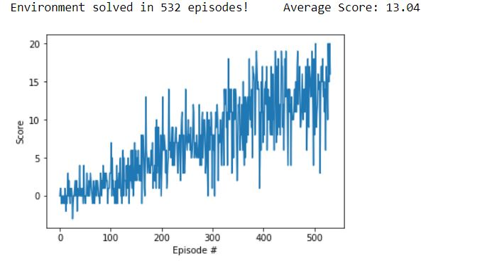

# Project 1: Navigation

### Introduction

For this project, I trained an agent to navigate and collect bananas in a large, square world.  

A reward of +1 is provided for collecting a yellow banana, and a reward of -1 is provided for collecting a blue banana.  Thus, the goal of the agent is to collect as many yellow bananas as possible while avoiding blue bananas.  

The state space has 37 dimensions and contains the agent's velocity, along with ray-based perception of objects around agent's forward direction.  Given this information, the agent has to learn how to best select actions.  Four discrete actions are available, corresponding to:
- **`0`** - move forward.
- **`1`** - move backward.
- **`2`** - turn left.
- **`3`** - turn right.

The task is episodic, and in order to solve the environment, the agent must get an average score of +13 over 100 consecutive episodes.

### Resolution

To solve the problem, I did a simple DQN, using a FFNN with three hidden layers of 128, 64 and 64 neurons each.
Other hyperparameters can be found in the dqn_agent.py file

To run an episode with the trained agent, run the cells in section 4 of the Navigation file

### How to use it

The main file is Navigation, the file is self-explanatory. To install the dependences needed follow the instructions from https://github.com/udacity/deep-reinforcement-learning

**If the Unity enviroment throws an error, restart the kernel**
